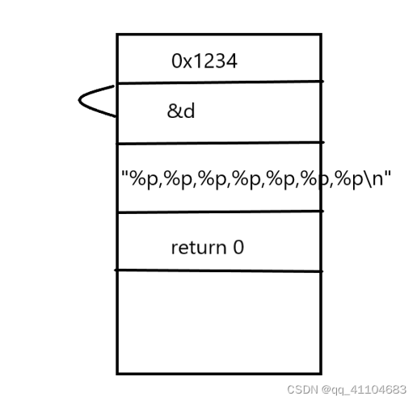
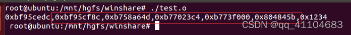
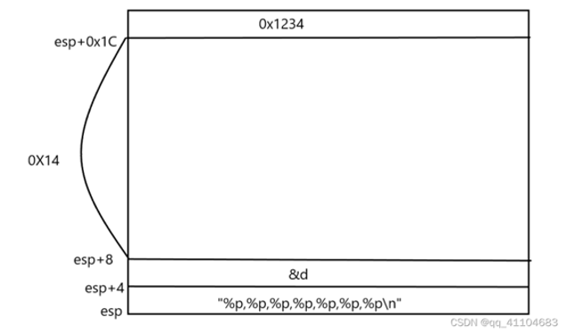

# C语言变参的实现
今天在群里突然看见有人询问printf的多个参数是怎么实现的，因为之前也没研究printf的源码，最近在研究linux，对这些底层实现比较感兴趣，所以研究了一下。

## 1.普通传参的底层实现：

&ensp;&ensp;1.将参数压入栈（这里就有了传统所说的形参和实参，真实的变量是实参，被压到栈中的是形参），call的函数通过读取栈中的数据进行传参，具体怎么调用可参考[ESP,EBP 汇编关于参数的传递 - 友学友 - 博客园 (cnblogs.com)](https://www.cnblogs.com/huangyong9527/archive/2012/08/14/2637987.html).

这里可以知道ebp是指向调用函数栈帧的栈顶，pc的地址是 ebp+4；第一个形参的地址是ebp+8，第二个参数地址：ebp+C，以此类推。

&ensp;&ensp;2.参数通过寄存器传递，例如linux中的FASTCALL(eax edx ecx ...)，inifinion单片机中参数传递（d2 d3 ...),这些都是编译器在汇编的时候约定好的。

一般的参数传递都是通过压栈实现。

## 2.printf(char * ,....)

&ensp;&ensp;根据传参的规则，变参的实现可能是printf压根不知道自己有多少个参数，只是根据char * 中%的数量来认知自己有多少参数。所以我设计了下面简单的测试代码
```
#include <stdio.h>
 
int main()
{
    int d=0x1234;
 
   printf("%p,%p,%p,%p,%p,%p,%p\n",&d);
   
   return 0;
}
```
根据传参的规则，当调用prinf的时候，栈中的数据应该是：

&emsp;&emsp;&emsp;

所以打印出来的第一个数应该的局部变量d的地址，第二个数应该就是0x1234

但是打印出来的数却是



这中间隔了5个数，不知道是啥，所以我查看了这个函数的汇编
```
0804841d <main>:
150  804841d:       55                      push   %ebp
151  804841e:       89 e5                   mov    %esp,%ebp
152  8048420:       83 e4 f0                and    $0xfffffff0,%esp
153  8048423:       83 ec 20                sub    $0x20,%esp  //申请了32字节的栈
154  8048426:       c7 44 24 1c 34 12 00    movl   $0x1234,0x1c(%esp) //申请变量d=0x1234，并压栈
155  804842d:       00
156  804842e:       8d 44 24 1c             lea    0x1c(%esp),%eax //取变量的地址
157  8048432:       89 44 24 04             mov    %eax,0x4(%esp)  //将变量地址放在sp+4，所以这里和d的地址相隔了0x1C-0x4-4=0x14(20，也就是5个word。)
158  8048436:       c7 04 24 e0 84 04 08    movl   $0x80484e0,(%esp) //将字符串放在栈顶
159  804843d:       e8 ae fe ff ff          call   80482f0 <printf@plt>
160  8048442:       b8 00 00 00 00          mov    $0x0,%eax
161  8048447:       c9                      leave
162  8048448:       c3                      ret
```



发现应该是编译器为了字节对齐，或者是害怕被调用函数printf不小心操作了调用函数main的局部变量，所以中间设置了5个word的缓冲（这些内存没任何设置，所以数据是随机的）

所以可以验证，所谓的变参只不过是按照字符串规定的方式，依次提取解析栈中的数据而已。