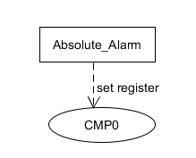
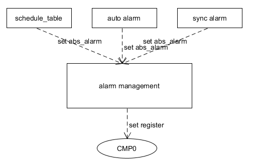
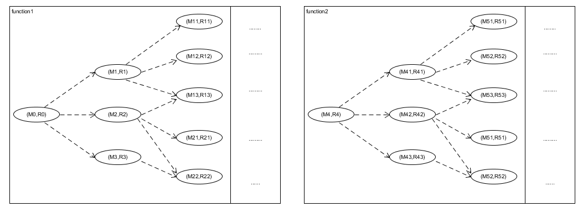

# [alarm的实现](./alarm2.html)

## alarm中断
对于infineon芯片，在[TC3xx文档 part2](https://github.com/ChuR3/Personal_Repo/tree/master/doc/infineon/TC3x)的第25.3中介绍了当CMP0和TIM0一致时将会触发一个时间中断。所以如果需要芯片实现alarm的功能，只需要将absolute_timer（cur_TIM0 + alarm_time）设置到CMP0寄存器中。随着TIM0 在晶振的作用下跳动到CMP0时，将会触发一个时间中断。

## 情景分析
但是在软件的应用场景中，可能不止有一个alarm同时设置，例如会有以下的需求

1. schedule_table需要设置alarm，当到达entry_point后激活task或set_event
2. 如果当runnable设置为auto时，会生成一个alarm单独设置该runnable的event
3. 在软件执行的过程中会有同步等待的需求，这时client会设置一个alarm然后睡眠。等待sever应答或者alarm超时后唤醒client，使其继续执行

&emsp;&emsp;.....

在软件运行的过程中，经常需要同时实现这些需求，但是在单核上却只有一个CMP0。如果对于这些alarm需求不加管理而直接设置CMP0，将会发生资源的竞争。所以需要以下模型对alarm进行管理，实现对CMP0的线性访问。

## 模型抽象
根据对alarm使用的情景分析，需要有一个模型对alarm进行管理，使其不发生对CMP0资源的竞争，并且能够每个alarm都满足其时间的要求。

设置alarm的目的是为了产生时间中断，但是alarm不是设置到CMP0中就马上产生时间中断，而是需要等到时间到达之后才会产生中断。所以如果alarm**大小**不同，其产生的时间中断是有先后的。

所以对alarm的管理，就是需要对alarm进行**排序**，这样alarm对应的时间中断就会按照用户需要的顺序产生。对于**排序模型**的实现可以参考[M6.046J](https://www.bilibili.com/video/BV1Kx411f7bL/?spm_id_from=333.337.search-card.all.click)。在以下模型中，vector选用的是最小堆排序：每次向最小堆所要数据时，总会输出最小值。

| 算法 | 时间复杂度 | 空间复杂度 | 适用场景 |
| ---- | ---- | ---- |---- |
| 插入排序 | O(n2) | O(n) | 大部分已经排序。比如银行支票 |
| 堆排序 | O(nlgn) | O(n) |  最值 |
| 归并排序 | O(nlgn) | O(nlgn) | 链表 |
| 快速排序 | O(nlgn) | O(n) | 大部分情况，但是要有随机数 |
| 桶排序 | O(n) | XX | hash排序 bitmap之类，空间复杂度取决于值范围 |
| 索引排序 | XX | O(n) | 时间复杂度取决于值的分段|

以task调度为例，简单叙述alarm运行的过程：

1. 当alarm或者schedule_table去激活task时，通过SetRelAlarm设置alarm,会将其相对时间换算成相对于TIM的absolute_time,放置到最小堆中（Os_PriorityQueueHeapUp），并将最小堆中最小的alarm放置到CMP0中
>SetRelAlarm有3个参数： alarm对象， 定时时间  ， 以及reload的定时时间。

2. 当CMP0设置的时间到之后，会产生时间中断，从而激活task或者set_event.

	- 将当前响应的alarm从最小堆中移除，并重新更新最小堆（Os_PriorityQueueHeapDown）。
	- 中断会检查当前的alarm是否有reload值，如果有会重新计算absolute_alarm放置到最小堆（实现task的周期执行）
	- 循环检查最小堆中是否有比TIM更小的alarm，如果有直接执行，并调整最小堆
3. 中断返回，继续等待下一次时钟中断重复前两步

## 性能分析
schedule_table和auto_alarm都是激活task使task得到调度。但是schedule_table相对于auto_alarm在系统性能方面可能有着独特的优势:

1. 对于rtos而言，对于不同task的执行可能有着严格的先后顺序。对此schedule_table可以将task分布到合适的entry_point(相同的TIM基准)就能实现。但是对于auto_alarm，因为每个alarm SetRelAlarm的TIM的基准不一致，很难对task执行的先后做出严格的安排，可能需要一些类似logical sequence management的功能
2. schedule_table可以在一个时间中断中激活多个task，但是auto_alarm却只能激活一个（并且还是以runnable为单位）。所以在执行同样多的task的时，schedule_table只需要一个alarm中断，而auto_alarm就可能有多个alarm中断。

对于第2点，直观来讲多次中断会不停的pending当前任务，执行长时间的中断服务程序之后(准备context)，激活task。这毫无疑问对rtos这种time_critical的操作系统影响是比较大的。

这种非必要的中断切换还可能会带来代码隐性的一些bug出现。要解释这一现象需要引入[程序是一组(M,R)的状态机](https://www.bilibili.com/video/BV1HN41197Ko?p=2)

假设此时cpu在function1的(M1,R1)状态。如果此时发生了中断，可能cpu会出现在function2的(M53,R53)状态。现在大部分的单片机项目可能压根没有对一些内存上锁(autosar的RTE是对struct上锁了，但是带来了极大的性能损耗)，所以如果M1和M53发生内存的竞争，将会导致function2和function1都会进入到一个undefined behavior。

每次中断返回的时候都会发生这样状态机的随机拼接，而且在真实软件设计中，状态机模型远比描述的要多并且复杂。所以当使用auto_alarm增加时钟中断的数量(满足的功能却和schedule_table一致)将会增加软件并发时的内存竞争的概率，可能引发一些极难复现的bug。