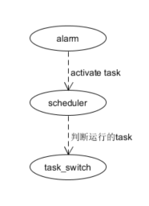

# Autosar blog
本系列关于autosar的所有内容都是基于vector的代码对于infinion实现，请结合vector的代码实现阅读。

## Communication

## OS
关于vector os的实现，抽象成以下的简单的结构

>由图可知，os的整个过程大概分为三步
>
>1. 设置[alarm](./alarm1.html)，alarm超时之后，set_event或者activate_task,使task能被scheduler调度
>
>2. 当中断返回,wait_event或者task结束时，会触发[scheduler](./scheduler.html)。scheduler会查看当前task优先级，选取一个当前需要运行的task
>
>3. 根据scheduler选取的task，os会设置next_task的运行环境，实现[task_switch](./task_switch.html)
