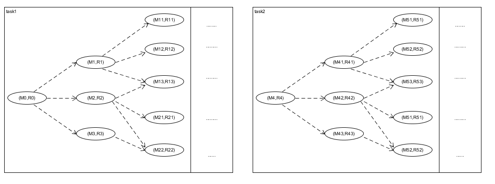
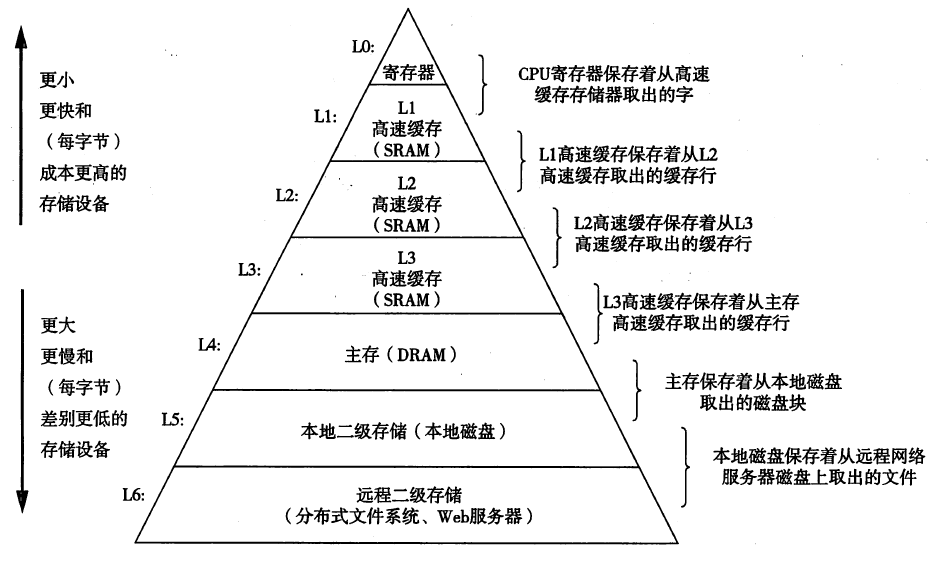

# 基于状态机模型分析task_switch

根据[程序的运行是一组(M,R)的状态机](./alarm1.html)的基本模型,如果想把上述的task1切换到task2,原理上只需要两步：
1. 所有的内存M0切换成M4
2. 所有的寄存器R0切换成R4

## 切换内存
对于单片机项目而言，没有MMU对进程的内存空间进行管理，所以不可能将进程的内存空间全部换成自己的内存。但是autosar可以使用MPU保护内存，此时内存虽然还是混在一起被使用，但是不会有unexpected access.

对于infineon芯片而言，只需要利用psw中的PRS切换不同的内存访问组(DPR和CPR)，可以初步控制task的内存访问权限，却没有像MMU那样的内存访问的损耗。

## 切换寄存器
根据《深入理解计算机系统》中存储器的层次结构，cpu直接交互的对象是寄存器,所以每一个task(更准确的说是function)进行切换时，都会对寄存器进行切换

如果需要对寄存器切换，需要有以下需求：
1. 需要保存当前被切换出task的寄存器
2. 要执行的task需要拿出**最近**保存的寄存器用于执行，保证其工作的连续性。

所以根据上述的需求，可以抽象出cpu是通过**栈结构**保存寄存器。对于[infineon芯片而言](https://github.com/ChuR3/Personal_Repo/tree/master/doc/infineon/TC3x)，利用一个PCXI寄存器实现了栈帧（CSA）控制的栈顶指针。
>CSA内存的申请和释放是从栈顶指针FCX指向的栈结构中获取的

但是CSA把几乎所有的core_register都记录下来，所以每次在task切换的时候，都会对当前的core_register做快照存在CSA中。但是在linux中，在每次task切换时之切换了两个寄存器：栈(sp)和pc。

这是因为POSIX规定编译器在编译时，寄存器是被caller_save或者callee_save,这样直接将寄存器保存在其运行的栈帧中，而不用另外独立维护一个CSA栈。并且有些function可能很简单，只需要1~2个寄存器保存其临时变量。所以linux这种方式虽然是软件实现，但是相比CSA有着很大的灵活性，所以其切换速度可能比CSA更快。