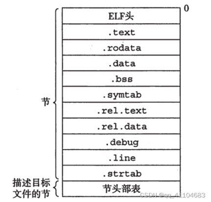
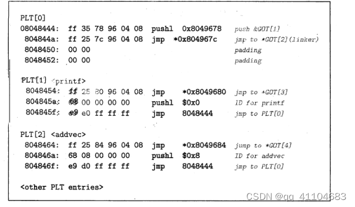

# 动态链接与可安装模块

这些现象在我接触linux之前一直困扰着我：

1. 为什么有些游戏软件2~3G的大小，只需要更新几兆的包，就可以有一些差异性的功能？

2. 为什么在安装驱动前不能操作IO,但是在安装驱动后，我们的应用软件就可以通过驱动程序访问IO,那么应用软件是如何找到驱动操作IO的函数的呢？

3. 对于linux而言，驱动属于内核的一部分，那么是不是意味这能随便改变内核的代码结构去访问硬件，linux是如何做到安全性和灵活性的平衡呢？

之所以存在上面的疑惑，是因为在嵌入式开发过程中，无论是多么微小的更改，都需要将整个工程重新编译链接，然后得到一个可执行文件，刷进cpu中执行。

## 动态链接

这部分内容主要来自《深入理解计算机系统》第7章内容，以下是对其总结：

1.编译之后，生成可重定位的目标文件，其格式为：

&emsp;&emsp;&emsp;

- .text:存放代码
- .rodata:存放只读数据，例如printf中的第一个传参字符串
- .data：存放初始化的全局或者静态变量
- .bss：未初始化的全局或者静态变量（为了节省空间，这个在磁盘上只是占位符，并不占空间）
- .symtab：存放该编译后文件全局(或者静态）变量（或者函数，之后统称为符号）的entry，单个 entry的构成是：

	&emsp;&emsp;&emsp;
	
	- name:对应.strtab段的第几个字符串
	- value：表示符号在具体段内的偏移
	- size：表示符号的大小
	- type：表示数据或者函数
	- bingding:表示是全局还是静态（local）
	- section：表示具体在那个段（根据书中描述：1.表示.text;3表示.data;COM表示.bss；udef表示在本文件中没被定义，即在头文件中声明的符号）
- .rel.text:引用全局函数的信息
- .rel.data:引用全局变量信息
	这两者是通过可重定位entry来表示：
	
	&emsp;&emsp;&emsp;
	
	- offset:表示符号引用位置在具体段内的偏移
	- symbol:在.strtab中的偏移
	- type：重定位时的类型（R_386_PC32表示用相对寻址来重定位（即PC+offset，注意书中在可重定位的目标文件中那个offset对应的初始值是0xFFFFFC，是因为pc指向下一个指令）;R_386_32表示以绝对地址来重定位）
- .debug,.line：记录调试信息，debug是调试符号表，line是行号和.text段的映射
- .strtab：字符串列表，以null结尾


> 注：
>> 1）.a的静态链接库是一组连接起来的可重定位目标文件的集合，可以通过如下方式生成静态链接库libvector.a：
>> 
>> &emsp;&emsp;&emsp;
>> 
>> 2）静态库的解析是从左向右进行的。有三个集合：E,文件集合；U未解析符号集合；D输入文件符号定义集合。解析.c时，会将文件，未定义符号，已定义符号分别放入E,U,D中。解析.a时，会查看.a中的那些文件包含了U中符号，才会将特定的文件和其符号放入E,U,D中。

2.整个链接过程大概可以分成两个过程
1. 将输入文件集合E中的各个段，根据链接脚本为各个段和符号赋予地址。
> 注：
>> 1）这个链接地址一般是和物理地址相同。但是也有不同的，比如intel寄存器中提供了cs，ds等段寄存器，那么cpu实际访问的地址是：段地址+链接地址（称为逻辑地址，两者的和为线性地址）；进一步如果使用了MMU,那么线性地址也不是实际的物理地址，而是虚拟地址。
>>> 例如在linux2.4.0（段地址是0）中，vmlinux.lds在刚开始就将.text段放在了0xC0000000 + 0x100000，这实际对应的就是内核虚拟地址的起始地址（0xC0100000 ），实际物理地址是0x100000。所以在刚开始没打开MMU时，要访问内存是通过（symbol（虚拟地址）-0xC0000000）访问的。
>>> 
>>> &emsp;&emsp;&emsp;
>>> 
>>> 更进一步，cpu访问的物理地址其实也只是通过地址总线发的总线地址，通过总线解析之后，那一块连接的可能是内存，也有可能是flash，也有可能是IO，也有可能什么都没有，所以物理地址也不是实际存在的，也是对硬件的总线结构的一层抽象而已。

>>  2）链接时如果两个.c文件中具有相同的符号，函数和初始化的全局变量被设置为强符号，而未初始化的全局变量被设置为弱符号。1.两者都为强符号时会链接错误；2.两者一个强一个弱时，链接以强符号为准；3.都为弱时，任意选一个

2. 将.rel.text和.rel.data中根据其type替换符号引用的地方offset处访问符号的值。
> 注：
>> 1）如果是静态链接，这里生成完全的可执行文件，就可以通过os加载到内存中执行了

>> 2）如果是动态链接，在之前需要通过如下命令生成动态链接库libvector.so
>> 
>> &emsp;&emsp;&emsp;
>> 
>> 然后通过编译链接生成可执行文件p2，但是这个p2和之前的可执行文件不同，是里面有一个.interp段（存储着动态链接器的路径），os通过这个路径加载运行这个动态连接器
>> 
>> &emsp;&emsp;&emsp;
>> 
>>> 动态链接器需要将动态链接库加载到进程的地址空间内，因为动态链接库是以位置无关（fPIC）的方式编译链接的，符号的访问是以相对寻址的方式，所以无论动态链接库加载到哪个地址空间，动态链接库内部都可以自由的访问，但是用户程序却需要动态链接库的接口访问地址，而这是通过全局偏量表（GOT）实现的
>>> 
>>> &emsp;&emsp;&emsp;
>>> 
>>> 用户程序在链接时，因为需要动态链接库，链接器给用户程序设置了一个GOT的表，表中的每一项表示着动态链接库中相应的接口（例如printf）在当前地址空间中的地址。而GOT的填充有两种方式：
>>> - 加载时链接，就是动态加载器在加载动态库时，动态加载器本身填写用户程序中的GOT,然后，用户程序在访问数据和代码时通过以下方式访问（编译链接时生成好的）：
>>>	
```
//通过GOT获取数据
	call L1
L1:	popl %ebx         //其实是将ebx=L1，这里以相对寻址方式编译，可以知道pc的绝对地址
	addl $VAROFF,%ebx  //获取变量位置的指针
	movl (%ebx),%eax    //获取变量位置
	movl（%eax），%eax    //获取变量
```
>>>	
```
	//通过GOT获取函数指针
		call L1
	L1:	popl %ebx         //其实是将ebx=L1，这里以相对寻址方式编译，可以知道pc的绝对地址
		addl $PROCOFF,%ebx  //获取函数指针的位置
		call *(%ebx)        //调用函数  
```
>>> - 运行时链接，在动态连接器加载动态库时，并不对GOT更改，但是当应用程序执行到对应的动态链接函数时，先执行一个wrapper（例如PLT[1]）.
>>> 
>>> &emsp;&emsp;&emsp;
>>> 
>>> 这个wrapper在第一次调用时，因为GOT[3]中存储的是下一句pushl地址，所以继续向下执行（调用GOT[2]中的动态连接器函数，传参是调用函数的标志0，和连接器的标志信息GOT[1]）;在第二次调用时，因为第一次动态连接器填充了GOT[4]，所以就可以直接跳到对应的动态链接库地址。

## 可安装模块
动态链接虽然可以解决某个模块的动态安装，但是这种方式并不能对进程的权限进行管控。而驱动模块恰恰是需要具有一定的权限才能操作硬件。所以需要有一种方式能将驱动模块动态安装，并且是安装到内核中，通过内核对其权限做管控。
在linux中，用户一般通过/sbin/insmod安装驱动模块(/sbin/rmmod卸载)。内核在运行的过程中如果缺少相关的驱动程序，也会通过request_module安装驱动。在linux2.4.0中request_module会开启一个内核线程运行exec_modprobe。
```
	/*
		modprobe_path is set via /proc/sys.
	*/
	char modprobe_path[256] = "/sbin/modprobe";
	static int exec_modprobe(void * module_name)
	{
		static char * envp[] = { "HOME=/", "TERM=linux", "PATH=/sbin:/usr/sbin:/bin:/usr/bin", NULL };
		char *argv[] = { modprobe_path, "-s", "-k", "--", (char*)module_name, NULL };
		int ret;
	//相当于执行/sbin/modprobe -s -k -- module_nameo,在环境变量envp中搜索module_name
	//exec_usermodehelper主要是1.更换其root和pwd，2.消除其signal处理，3.关闭内核线程所有fd，4.更新其user是init_task,并赋予所有的进程权限cap_effective，5.整个内存空间的访问权限KERNEL_DS，6.最后通过execve执行/sbin/modprobe
		ret = exec_usermodehelper(modprobe_path, argv, envp);
		if (ret) {
			printk(KERN_ERR
				   "kmod: failed to exec %s -s -k %s, errno = %d\n",
				   modprobe_path, (char*) module_name, errno);
		}
		return ret;
	}

```
> 注：根据busybox1.24.0,modprobe主要的执行函数是modprobe_main，这个函数通过读取配置文件，查看要求安装模块的依赖模块（如果依赖模块没被安装（被安装的模块在/proc/modules中），需要被安装），其他大致和insmode类似。

### insmode安装驱动模块
&ensp;&ensp;insmode主要通过以下步骤将驱动模块安装到内核中：
1. 通过mmap将obj映射至虚拟内存，并通过obj_load对obj_file进行解析（主要是按照header对段和符号进行解析，段装入f->sections中，符号装入hash表f->symtab中）

<div class="code-container">
<div class="code-header">
<h3>busybox1.24.0:    insmod_main->bb_init_module_24->obj_load</h3>
<button class="toggle-button">展开</button>
</div>

```
static struct obj_file *obj_load(char *image, size_t image_size, int loadprogbits){
 
//从内存映像image中获取头部信息，
    memcpy(&f->header, image, sizeof(f->header));
 
...
//映像中段的数目，并申请段的指针数组
shnum = f->header.e_shnum;
f->sections = xzalloc(sizeof(f->sections[0]) * (shnum + 4));
...
//获取段的管理信息section_header
memcpy(section_headers, image + f->header.e_shoff, sizeof(ElfW(Shdr)) * shnum);
 
//遍历段的指针数组，初始化
for (i = 0; i < shnum; ++i) {
 
    f->sections[i] = sec = arch_new_section();
    sec->header = section_headers[i];
	sec->idx = i;
    ...
    //如果段存在（sh_size不为0），查看段的类型
    switch (sec->header.sh_type) {
            case SHT_SYMTAB:            //所有引用符号表
	        case SHT_STRTAB:            //name数组
		    case SHT_RELM:              //引用符号表
                ...
                sec->contents = xmalloc(sec->header.sh_size)
                ...
                memcpy(sec->contents, image + sec->header.sh_offset, sec->header.sh_size);
            break;
		}
        
        }
    }
//初始化每个段的名称
shstrtab = f->sections[f->header.e_shstrndx]->contents;
for (i = 0; i < shnum; ++i) {
		struct obj_section *sec = f->sections[i];
		sec->name = shstrtab + sec->header.sh_name;
}
//再次遍历所有段
for (i = 0; i < shnum; ++i) {
 
//需要对段进行重定位的，按优先级的从大到小顺序插入到链表load_order_search_start（load_order）中
    ...
    if (sec->header.sh_flags & SHF_ALLOC)
			obj_insert_section_load_order(f, sec);
    ...
    switch (sec->header.sh_type) {
        case SHT_SYMTAB:        //符号表
            ....
            //申请local变量的符号指针数组
            j = f->local_symtab_size = sec->header.sh_info;
			f->local_symtab = xzalloc(j * sizeof(struct obj_symbol *));
            ....
            //遍历段中的所有引用的符号
            for (j = 1, ++sym; j < nsym; ++j, ++sym) {
                ...
                //将符号加入到hash中,局部变量要加入到local_symtab中
                obj_add_symbol(f, name, j, sym->st_info, sym->st_shndx,
							val, sym->st_size);
                ....
            }
}
}
```
</div>


<p/>
<div class="code-container">
<div class="code-header">
<h3>busybox1.24.0:    insmod_main->bb_init_module_24->obj_load->obj_add_symbol</h3>
<button class="toggle-button">展开</button>
</div>

```
static struct obj_symbol *
obj_add_symbol(struct obj_file *f, const char *name,
		unsigned long symidx, int info,
		int secidx, ElfW(Addr) value,
		unsigned long size){
 
//查找映像中是否有和其相同的符号,这个在第一步中没有执行，之后在加内核符号的时候会用到
for (sym = f->symtab[hash]; sym; sym = sym->next) {
		if (f->symbol_cmp(sym->name, name) == 0) {
 
        ...
            //如果符号被外部引用，返回映像中的符号
            if (secidx == SHN_UNDEF)
				return sym;
 
            //如果映像引用外部符号，更改hash中的符号信息
			else if (o_secidx == SHN_UNDEF)
				goto found;
 
            //如果外部是全局的，内部是静态的，用全局替换静态的
            else if (n_binding == STB_GLOBAL && o_binding == STB_LOCAL) {
            ...
            nsym = arch_new_symbol();
            //将其从hash表中替换
			nsym->next = sym->next;
            ...
            for (p = &f->symtab[hash]; *p != sym; p = &(*p)->next)
					continue;
			*p = sym = nsym;  //原来的sym结构体还有local_symtab能访问
			goto found;
 
            ...
 
            //如果内部是弱类型，将其转换成外部变量
            else if (o_binding == STB_WEAK)
				goto found;
            ...
}
 
...
//如果在映像中没找到符号，将其加入到hash中
sym = arch_new_symbol();
sym->next = f->symtab[hash];
f->symtab[hash] = sym;
...
//如果是静态的，将其加入到静态表中
if (ELF_ST_BIND(info) == STB_LOCAL && symidx != (unsigned long)(-1)) {
...
f->local_symtab[symidx] = sym;
}
 
//将符号赋成外部信息
found:
	sym->name = name;
	sym->value = value;
	sym->size = size;
	sym->secidx = secidx;
	sym->info = info;
 
}
```
</div>

2. 通过query_module向内核询问内核中的模块，及模块中export的符号定义（通过ext_modules 管理所有module，通过ksyms 管理内核自身export的符号）
<div class="code-container">
<div class="code-header">
<h3>busybox1.24.0:    insmod_main->bb_init_module_24->add_kernel_symbols</h3>
<button class="toggle-button">展开</button>
</div>

```
static void add_kernel_symbols(struct obj_file *f){
 
    bufsize = 256;
	module_names = xmalloc(bufsize)
    //向内核请求内核中所有模块的名称
    if (query_module(NULL, QM_MODULES, module_names, bufsize, &ret)) {
    ...
    //内核模块的数目
    n_ext_modules = nmod = ret;
    ...
 
    ...
    //申请nmod 个module的数据结构，通过ext_modules 管理所有的模块（不包含内核本身），遍历数组module_names 
    ext_modules = modules = xzalloc(nmod * sizeof(*modules));
		for (i = 0, mn = module_names, m = modules;
				i < nmod; ++i, ++m, mn += strlen(mn) + 1) {
            
            ...
            //向对应的模块请求模块管理结构的地址
            if (query_module(mn, QM_INFO, &info, sizeof(info), &ret)) {
            ...
 
            //向对应的模块请求其符号信息
            bufsize = 1024;
			syms = xmalloc(bufsize);
            if (query_module(mn, QM_SYMBOLS, syms, bufsize, &ret))
 
            ...
            //初始化模块信息
            m->name = mn;
			m->addr = info.addr;
			m->nsyms = nsyms;
			m->syms = syms;
    ...
 
    //请求内核自身的符号信息，通过ksyms 管理
    bufsize = 16 * 1024;
	syms = xmalloc(bufsize);
    if (query_module(NULL, QM_SYMBOLS, syms, bufsize, &ret)) {
    ...
    nksyms = nsyms = ret;
	ksyms = syms;
 
}
```
</div>
<p/>
<div class="code-container">
<div class="code-header">
<h3>linux2.4.0: sys_query_module</h3>
<button class="toggle-button">展开</button>
</div>

```
asmlinkage long
sys_query_module(const char *name_user, int which, char *buf, size_t bufsize,
		 size_t *ret){
 
    ...
    //如果没有传名称，查询的就是内核，否则利用find_module通过name在module_list链表中查找相应的模块
    if (name_user == NULL)
		mod = &kernel_module;
	else {
        ...
        if (namelen == 0)
			mod = &kernel_module;
        else if ((mod = find_module(name)) == NULL) 
    ...
    ...
    //如果找到了要查询的module，根据类型将查询的内容返回给用户
    switch (which)
	{
	case 0:
		err = 0;
		break;
	case QM_MODULES: //查询内核中的模块名称（module_list链表中所有模块）
		err = qm_modules(buf, bufsize, ret);
		break;
	case QM_DEPS:
		err = qm_deps(mod, buf, bufsize, ret);
		break;
	case QM_REFS:
		err = qm_refs(mod, buf, bufsize, ret);
		break;
	case QM_SYMBOLS://查询对应模块中的符号（module的管理结构中有一个数组mod->syms，里面有该模块所有的（name，value）的信息）
		err = qm_symbols(mod, buf, bufsize, ret);
		break;
	case QM_INFO:
		err = qm_info(mod, buf, bufsize, ret);
		break;
	default:
		err = -EINVAL;
		break;
	}
 
}
```
</div>

> 注：内核中有一个宏EXPORT_SYMBOL
> 
<div >
<div class="code-header">
<h3>linux2.4.0:</h3>
</div>

```
	#define __EXPORT_SYMBOL(sym, str)			\
	const char __kstrtab_##sym[]				\
	__attribute__((section(".kstrtab"))) = str;		\
	const struct module_symbol __ksymtab_##sym 		\
	__attribute__((section("__ksymtab"))) =			\
	{ (unsigned long)&sym, __kstrtab_##sym }
	 
	#define __MODULE_STRING_1(x)	#x
	#define __MODULE_STRING(x)	__MODULE_STRING_1(x)
	 
	#define EXPORT_SYMBOL(var)  __EXPORT_SYMBOL(var, __MODULE_STRING(var))
	 
	//整合之后,有一个module_symbol结构体__ksymtab_var被链接到"__ksymtab"段，其val=&var，name指向__kstrtab_var；__kstrtab_var指向的内容被链接到".kstrtab"段，其值是#var
	 
	#define EXPORT_SYMBOL(var) \
	const char __kstrtab_var[] __attribute__((section(".kstrtab")))=#var(var字符串形式);\
	const struct module_symbol __ksymtab_var __attribute__((section("__ksymtab"))) ={(unsigned long)&var, __kstrtab_var};
```
</div>

3. 将内核和其他模块的符号信息加入到映像中，并将驱动模块中的SHF_ALLOC段分配地址。
- 添加内核和模块符号到映像中
<div >
<div class="code-header">
<h3>busybox1.24.0:    insmod_main->bb_init_module_24->add_kernel_symbols</h3>
</div>

```
	static void add_kernel_symbols(struct obj_file *f){
	 
		....
		//遍历所有的外部模块，如果外部模块中的符号又被驱动模块引用，m->used = 1
		for (i = 0, m = ext_modules; i < n_ext_modules; ++i, ++m) {
			if (m->nsyms
			 && add_symbols_from(f, SHN_HIRESERVE + 2 + i, m->syms, m->nsyms)
			)
			{
				m->used = 1;
				++nused;
			}
	 
		}
		//被驱动模块使用的模块的数量
		n_ext_modules_used = nused;
	 
		//如果驱动模块引用内核符号，将其添加到映像中
		if (nksyms)
			add_symbols_from(f, SHN_HIRESERVE + 1, ksyms, nksyms);
	}
```
</div>
<p/>
<div >
<div class="code-header">
<h3>busybox1.24.0:    insmod_main->bb_init_module_24->add_kernel_symbols->add_symbols_from</h3>
</div>

```
	static int add_symbols_from(struct obj_file *f,
			int idx,
			struct new_module_symbol *syms,
			size_t nsyms){
	 
	 
			....
			//如果映像中存在外部的一些符号（使用或者被使用），并且不是local
			sym = obj_find_symbol(f, name);
			if (sym && !(ELF_ST_BIND(sym->info) == STB_LOCAL)) {
				
				sym = obj_add_symbol(f, name, -1,
						ELF_ST_INFO(STB_GLOBAL,
							STT_NOTYPE),
						idx, s->value, 0);
				//如果是用外部符号解析映像中的一些UNDEF(引用的符号)，返回1
					if (sym->secidx == idx)
						used = 1;
			}
			....
	}
```
</div>

- 通过obj_check_undefineds分析是否还存在没被解析的符号（SHN_UNDEF），通过obj_allocate_commons为SHN_COMMON的符号分配bss段
- 链接所有的SHF_ALLOC段
<div >
<div class="code-header">
<h3>busybox1.24.0:    insmod_main->bb_init_module_24->obj_load_size</h3>
</div>

```
	static unsigned long obj_load_size(struct obj_file *f){
		....
		//遍历链表load_order（注意load_order在obj_load中建立，之后也会在加一些SHF_ALLOC段时，也会加到load_order链表中），为链表中每个段都赋予地址sh_addr ，整体链接的长度是dot 
		for (sec = f->load_order; sec; sec = sec->load_next) {
		...
		sec->header.sh_addr = dot;
		dot += sec->header.sh_size;
		}
		....
	 
	}
```
</div>

4. 通过create_module让内核分配空间
<div >
<div class="code-header">
<h3>linux2.4.0: sys_create_module</h3>
</div>

```
asmlinkage unsigned long
sys_create_module(const char *name_user, size_t size){
    ....
    //内核中要没有这个模块
    if (find_module(name) != NULL) {
		error = -EEXIST;
        	goto err1;
	}
    //申请module的内存空间
	if ((mod = (struct module *)module_map(size)) == NULL) {
		error = -ENOMEM;
		goto err1;
	}
 
    //初始化，并链入到链表module_list 
    memset(mod, 0, sizeof(*mod));
	mod->size_of_struct = sizeof(*mod);
	mod->next = module_list;
	mod->name = (char *)(mod + 1);
	mod->size = size;
	memcpy((char*)(mod+1), name, namelen+1);
    ...
    module_list = mod;
    ...
}
```
</div>

5. 将模块中对变量的引用重定位
<div class="code-container">
<div class="code-header">
<h3>busybox1.24.0:    insmod_main->bb_init_module_24->obj_relocate</h3>
<button class="toggle-button">展开</button>
</div>

```
static int obj_relocate(struct obj_file *f, ElfW(Addr) base){
    ...
    //base是向内核申请内存空间的基地址，这里对每个段进行重定位
    f->baseaddr = base;
	for (i = 0; i < n; ++i)
		f->sections[i]->header.sh_addr += base;
 
    ...
    for (i = 0; i < n; ++i) {
        ...
        //对段中引用变量的位置重定位
        relsec = f->sections[i];
		if (relsec->header.sh_type != SHT_RELM)
			continue;
 
        ...
 
        for (; rel < relend; ++rel) {
            ...
            //找到符号及其对应的值
            symndx = ELF_R_SYM(rel->r_info);
            ...
            value = obj_symbol_final_value(f, intsym);
            
 
            ...
            //对符号重定位
            /*arch_apply_relocation中主要内容
                ...
                //符号引用的地址
                ElfW(Addr) dot = targsec->header.sh_addr + rel->r_offset;
                ...
                //直接寻址
                case R_386_32:
			        *loc += v;
			         break;
                //相对寻址
                case R_386_PLT32:
		        case R_386_PC32:
		        case R_386_GOTOFF:
			        *loc += v - dot;
			        break;
            */
            switch (arch_apply_relocation
					(f, targsec, /*symsec,*/ intsym, rel, value)
			)
        ...
        }
      }
}
```
</div>

6. 准备好内核数据，并调用init_module
<div class="code-container">
<div class="code-header">
<h3>busybox1.24.0:    insmod_main->bb_init_module_24->new_init_module</h3>
<button class="toggle-button">展开</button>
</div>

```
static int
new_init_module(const char *m_name, struct obj_file *f, unsigned long m_size){
 
    ...
    //将初始化的信息放在".this"段的开始，根据new_create_this_module可知".this"段在load_order链表中的首个段，后面看到contents会被复制到内存空间，所以其前sizeof(struct new_module)是存储module的初始化信息的
    sec = obj_find_section(f, ".this");
    ...
    module = (struct new_module *) sec->contents;
    //之后根据各个段的内容（"__ksymtab"、".kmodtab"，"init_module"，"cleanup_module"等）对module中的各个字段进行初始化
    ...
 
    ...
    //申请用户内存，复制content，然后经过init_module传递到内核
    image = xmalloc(m_size);
    /*
 
        for (sec = f->load_order; sec; sec = sec->load_next) {
 
            ...
            secimg = image + (sec->header.sh_addr - base);//复制到申请内存的相对地址上
            memcpy(secimg, sec->contents, sec->header.sh_size);
            ...
        }
 
    */
	obj_create_image(f, image);
 
    //要求操作系统复制module信息和load_order段链表中的content内容到内核，并由内核进行模块的初始化操作
    ret = init_module(m_name, (struct new_module *) image);
    ...
 
}
```
</div>
<p/>
<div class="code-container">
<div class="code-header">
<h3>linux2.4.0: sys_init_module</h3>
<button class="toggle-button">展开</button>
</div>

```
asmlinkage long
sys_init_module(const char *name_user, struct module *mod_user){
 
    ...
    //从module_list中找到sys_create_module申请的module结构体
    if ((mod = find_module(name)) == NULL) 
    ...
 
    //前面有大量的module结构的检查，这里只列举对name的检查
    //用户空间中的name是在new_create_this_module中通过obj_string_patch打了patch（reloc_offset是offsetof(struct new_module, name)），在obj_relocate的最后将string的patch根据reloc_offset添加到段的content中。
    if ((n_namelen = get_mod_name(mod->name - (unsigned long)mod
				      + (unsigned long)mod_user,
				      &n_name)) < 0)
    ...
 
    //为驱动模块的依赖模块建立结构管理
    //将依赖的模块在busybox中通过new_create_module_ksymtab建立，并打patch，在obj_relocate中复制到段的content中，最后在new_init_module和module中的相关字段关联
    for (i = 0, dep = mod->deps; i < mod->ndeps; ++i, ++dep)
    ...
 
    //调用mod->init，完成内核访问驱动模块的路径。
    if (mod->init && (error = mod->init()) != 0)
    ...
 
}
```
</div>

### mod->init向文件系统注册
<div >
<div class="code-header">
<h3>linux2.4.0：硬盘驱动</h3>
</div>

```

static int hwif_init (ide_hwif_t *hwif){
    ...
    //向devfs注册硬盘设备
    if (devfs_register_blkdev (hwif->major, hwif->name, ide_fops))
    ...
 
}
```
</div>

&ensp;&ensp;IO设备在内核中被抽象成“一组能与CPU交换数据的接口”（这里是ide_fops），将这个接口向文件系统注册（可以是物理存在的文件系统，比如ext2；也可以是虚拟文件系统procfs，devfs），然后在文件系统中形成相应的设备文件。通过文件的常规操作open，write，read，ioctl等对设备文件进行操作，最后通过注册的路径而去访问ide_fops。

&ensp;&ensp;创建设备节点的具体过程涉及到文件系统的相关操作，具体请参考《Linux内核源代码情景分析》或者[linux2.4.0流程图](../../linux/linux2.4.0.uxf)
## 总结
1. 为什么有些游戏软件2~3G的大小，只需要更新几兆的包，就可以有一些差异性的功能？

	答：这些更新的都是.so(linux)/.dll(windows)这样的动态链接库，他们在操作系统运行游戏软件时会加载到内存空间，并且会由动态链接加载器进行动态链接。
2. 为什么在安装驱动前不能操作IO,但是在安装驱动后，我们的应用软件就可以通过驱动程序访问IO,那么应用软件是如何找到驱动操作IO的函数的呢？

	答：在安装设备的时候，操作系统会创建设备文件，通过这个设备文件可以找到对设备操作的接口（ide_fops），从而访问设备。
3. 对于linux而言，驱动属于内核的一部分，那么是不是意味这能随便改变内核的代码结构去访问硬件，linux是如何做到安全性和灵活性的平衡呢？

	答：驱动只能访问内核或者其他模块export出来的符号，而不能随意访问内核的任意符号（否则在insmode时会因为找不到符号而报错）。
## 参考书籍和视频：
- 《深入理解计算机系统》
- 《Linux内核源代码情景分析》
- [2020 南京大学 “操作系统：设计与实现” (蒋炎岩)](https://www.bilibili.com/video/BV1N741177F5?p=26)