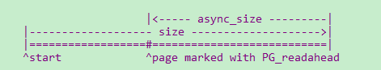
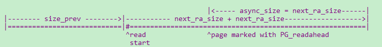
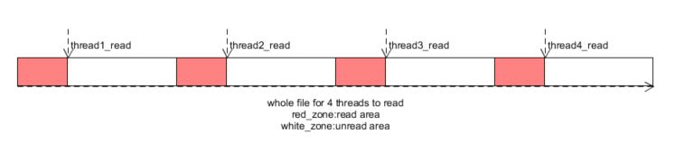

# 文件预读
为了优化读取文件的时间延迟，文件系统(FS)在去磁盘读取文件时会有一个read_ahead的动作。主要思路是：当FS发现用户读取文件是按照文件的顺序读取，FS就假定用户在下一次读取时大概率会读取下一个block。

所以FS在把当前的block读取到内存后，会发送读取下一个block的命令，然后将当前block数据返回给用户。这样用户在处理数据的时候，磁盘IO也在并行的执行(如果是DMA的方式，磁盘IO在完成之后，会通过中断的方式告诉FS)

这个预读过程是FS猜测用户大概率会读，如果用户不读取，既会浪费磁盘IO时间，也会浪费内存，还会浪费cpu的执行时间。所以需要一定的指标衡量预读。

1. 文件读取是否是**顺序读取**，如果是随机读，因为没办法预测，所以不需要预读
2. 如果文件是顺序读，就需要根据之前读取的规律判断**预读窗口**，这样就不会将过多的数据读取到内存中。

linux4.4.0的预读算法是在ondemand_readahead中实现的,它预测**顺序读取**的行为，通过控制一个预读结构file_ra_state，从而实现对**预读窗口**的控制

>注：ra.start：读取的起始位置
>
>&emsp;&emsp;ra.size:读取的窗口
>
>&emsp;&emsp;ra.async_size: 当用户读到标记为Readahead的page时，会触发异步预读

## 首次预读
1. 顺序读取识别
	1. 初次读取（即file.f_pos为0）,会设置初始窗口进行预读

		

	2. 上一次读取时并不满足预读的条件，但是此次是严格的顺序读（offset和ra.prev_pos的偏差在一页以内）。所以需要根据当前的req_size选择init_ra_size
		
	>ra.prev_pos：表示用户上次读取位置

	3. 单次读取的量超过了ra->ra_pages，因为检查到大块面积的读取，用户大概率顺序读，所以也会根据req_size初始化预读窗口
			
	>ra.ra_pages:表示最大的预读窗口
2. 初始预读窗口设置

	1. 初始窗口的设置是根据此次读取请求的req_size决定的。根据req_size和ra.ra_pages的相对大小，选取预读窗口，但是最大不能超过ra.ra_pages。
	2. 当req_size超过ra_pages时，ondemand_readahead设计会触发一个异步预读窗口，让async_size的大小通过get_next_ra_size扩大(size也随之扩大)

## 预读窗口内部读取
### 1. 预读窗口内的一般位置不会触发预读
&emsp;每次do_generic_file_read发现需要的page不在内存中，就会通过page_cache_sync_readahead进行同步预读，会判断是否需要预读。

&emsp;如果需要预读会设置预读窗口，在设置窗口之后会为窗口中的段申请pages。当读取到在预读窗口内的page时（此时的page不一定和磁盘同步，如果do_generic_file_read发现不同步会通过lock_page进行同步等待page uptodate），此时因为能找到page所以不会触发预读操作

>注：预读窗口内大部分page不会触发，但是有两个例外
>
>&emsp;&emsp;1.标记了Readahead的page会触发异步预读
>
>&emsp;&emsp;2.预读窗口读取完成之后

### 2.异步预读
1. 顺序读取识别--当读取到标记Readahead的page时，将触发异步预读page_cache_async_readahead

	1. 单线程读取file时，ra结构只会随着本线程的读取而变化，Readahead page一定会在(ra->start + ra->size - ra->async_size)的位置
	2. 多线程读取时，因为ra结构是进程内多线程共用的，所以每个线程再查看自己的ra时，Readahead page不一定在单线程所在的位置上。
	
		>但是此时因为检测到page Readahead标记，从而触发的异步预读page_cache_async_readahead，会将hit_readahead_marker置上。

2. 预读窗口设置

	当识别到上次顺序读完成，而触发下一次顺序读的时候，通过get_next_ra_size扩大预读窗口，这个扩大策略是基于ra_size进行扩大，相对于init_ra_size会更宽松，但是仍然不能超过ra_pages。

	1. 单线程读取时
	
	
	
	2. 多线程读取时，ra已经失效，所以通过page_cache_next_hole查看该线程当前连续存在的page作为next_ra_size的输入
	
	

### 3.预读窗口读完
1. 顺序读取识别--当FS读取到(ra->start + ra->size)时，意味着预读窗口读取完成，将会触发下一波的同步预读
2. 预读窗口设置--会触发一个异步预读窗口

	

## 多线程读取
当没有检查到上述顺序读的特征时，并不能表示用户没有进行顺序读。因为如果是一个进程内的多个线程对文件进行分段读取，对于每一个线程来说可能都是顺序读取，但是因为多线程之间的切换会改变ra的结构，从而检测不到顺序读取的特征。在linux4.4.0中，通过try_context_readahead检查这一特征。

1. 顺序读取识别--通过count_history_pages识别线程连续读取的page数（红色区域），要求超过此次的req_size
2. 预读窗口设置

	

